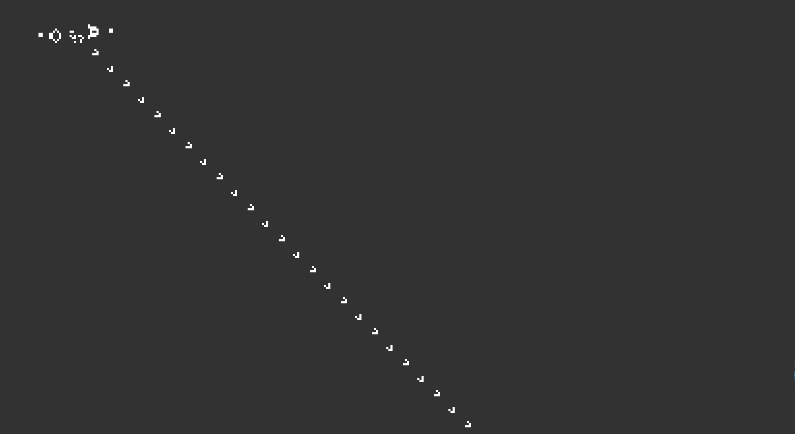

# ConwaysGameOfLife
A c++ version of Conway's Game Of Life.

# About
This is Conway's Game Of Life.
The Game of life is basic concept of cellular automata. It's a grid of cell's where a cell is either dead or alive.
The cells live depends on 3 basic conditions:
- If the cell is alive and has less than 2 neighbouts, it dies.
- If the cell is alive and it has more than 3 neighbours, it dies.
- If the cell is dead and it has exactly 3 neighbours, it becomes alive.

Using these basic rules you can create a complex system of living cells.
In the picture above you have a **glider cannon** (at the top) which creates smaller **gliders** (the small, diagonally moving cells).

# Libraries
For creating and drawing on the screen and for capturing input from mouse and keyboard, I used SDL2.
I made a small framework using the basic game loop. Where I handle input, update the scene and render it to the screen.

# Controls
- Spacebar: start/stop simulating
- Enter: show/hide the grid
- Backspace: clear the grid

# Features I might add later
- On screen/in console settings to choose resolution, the size of the cells, etc..
- Loading/saving data to a file so you can load previously made scenes or save scenes you made

